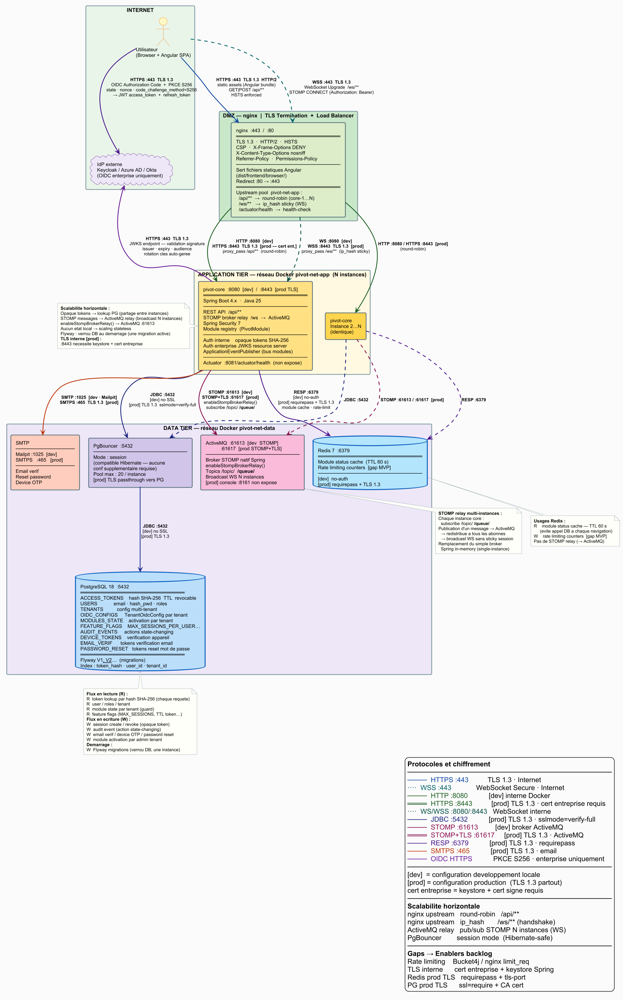

# Architecture cible — PIVOT Platform

## Vue d'ensemble

PIVOT est une suite collaborative auto-hébergeable, conçue pour les associations, TPE/PME et entreprises. Elle repose sur un système de **modules activables individuellement** par tenant.



> Source PlantUML : [`diagrams/platform-overview.puml`](diagrams/platform-overview.puml)

---

## Flux et protocoles

**Cible prod : TLS 1.3 sur tous les flux (Zero Trust). Dev : HTTP/WS/no-auth en réseau Docker isolé.**

| Lien | Protocole | Dev | Prod |
|------|-----------|-----|------|
| Browser → nginx | HTTPS :443 | TLS 1.3 | TLS 1.3 · HTTP/2 · HSTS |
| Browser → nginx | WSS :443 /ws/** | TLS 1.3 | TLS 1.3 · STOMP upgrade |
| nginx → pivot-core | HTTP/HTTPS | HTTP :8080 | HTTPS :8443 · TLS 1.3 · cert entreprise |
| nginx → pivot-core | WS/WSS | WS :8080 | WSS :8443 · TLS 1.3 · ip_hash sticky |
| pivot-core → PgBouncer | JDBC :5432 | no SSL | TLS 1.3 · `sslmode=verify-full` |
| PgBouncer → PostgreSQL | JDBC :5432 | no SSL | TLS 1.3 |
| pivot-core → ActiveMQ | STOMP | :61613 | :61617 STOMP+TLS 1.3 |
| pivot-core → Redis | RESP :6379 | no-auth | TLS 1.3 · `requirepass` |
| pivot-core → SMTP | SMTP/SMTPS | :1025 Mailpit | :465 SMTPS · TLS 1.3 |
| Browser → IdP | HTTPS :443 | TLS 1.3 | TLS 1.3 · OIDC PKCE S256 |
| pivot-core → IdP JWKS | HTTPS :443 | TLS 1.3 | TLS 1.3 · rotation auto-gérée |

> TLS interne [prod] nécessite un keystore Spring Boot + cert signé (entreprise ou CA interne). Enabler backlog dédié.

---

## Couches techniques

| Couche | Technologie | Repo |
|--------|-------------|------|
| Frontend | Angular 22 · TypeScript strict · SCSS BEM | pivot-ui |
| Reverse proxy / TLS | nginx · HSTS · CSP · X-Frame-Options | pivot-ui |
| API REST | Spring Boot 4.x · Java 25 · Maven | pivot-core |
| Base de données | PostgreSQL 18 · Spring Data JPA · Flyway | pivot-core |
| Cache / Temps réel | Redis 7 (module cache TTL · rate limiting) | pivot-core |
| Message broker | ActiveMQ · STOMP relay (WS multi-instances) | pivot-core |
| Auth interne | Spring Security 7 · Opaque tokens SHA-256 (BDD) | pivot-core |
| Auth enterprise | OIDC PKCE S256 (Angular) · resource server JWKS (Spring) | pivot-core + pivot-ui |
| Tests backend | JUnit 5 · Mockito · Testcontainers | pivot-core |
| Tests frontend | Vitest · Playwright | pivot-ui |
| CI/CD | GitHub Actions · SonarCloud · Plumber · Semantic Release | tous |
| Déploiement | Docker · Docker Compose | tous |

---

## Mécanismes d'authentification

PIVOT supporte deux mécanismes distincts selon le contexte de déploiement :

| Mécanisme | Contexte | Détail |
|-----------|---------|--------|
| **Opaque tokens** | Auth interne (email/password) | Token 256-bit SecureRandom · hash SHA-256 stocké en BDD (`access_tokens`) · raw token jamais persisté · TTL en BDD · révocable · max 5 sessions/utilisateur |
| **OIDC enterprise** | Tenants avec IdP externe | PKCE S256 côté Angular · validation JWKS côté Spring · multi-tenant (`TenantOidcConfig`) · rotation de clés IdP transparente |

> Access token toujours en mémoire uniquement — **jamais localStorage, jamais cookie**. Voir [ADR-005](../adr/ADR-005-opaque-tokens.md).

**WebSocket auth** : Spring Security intercepte le handshake HTTP → opaque token vérifié avant l'upgrade WebSocket → connexion STOMP sécurisée.

**CORS** : `http://localhost:4200` strict en dev. En prod avec nginx proxy, les appels API sont same-origin → CORS non requis côté pivot-core.

---

## Modules activables

Chaque module est activable indépendamment par les admins tenant.

| Module | Description | Inspiration |
|--------|-------------|-------------|
| `whiteboard` | Tableau blanc collaboratif temps réel | PouetPouet |
| `session` | Sessions live : QUIZ, POLL, WORDCLOUD, BRAINSTORM, QA | Klaxoon |
| `roadmap` | Roadmap / Gantt intégré | — |
| `survey` | Système de sondage | — |
| `quiz` | Quiz interactif gamifié | Kahoot |

### Principe d'isolation

- Module désactivé → 403 côté API + bundle Angular non chargé (lazy-loading)
- Aucune logique inter-module directe → `ApplicationEventPublisher` (backend) · services core Angular (frontend)
- Contrat de module défini par `PivotModule` interface (voir [ADR-003](../adr/ADR-003-systeme-modules.md))

---

## Schéma de rôles

| Rôle | Périmètre | Droits |
|------|-----------|--------|
| `ROLE_SUPER_ADMIN` | Plateforme | Gestion tenants, configuration globale |
| `ROLE_ADMIN` | Tenant | Activation modules, gestion utilisateurs |
| `ROLE_USER` | Tenant | Utilisation des modules activés |
| `ROLE_GUEST` | Session | Participation anonyme (sessions live) |

---

## Scalabilité horizontale

| Aspect | Mécanisme |
|--------|-----------|
| **Load balancing REST** | nginx upstream pool · round-robin `/api/**` |
| **Load balancing WebSocket** | nginx ip_hash sticky `/ws/**` (handshake) · puis ActiveMQ relay (STOMP messages broadcast) |
| **State partagé** | Opaque tokens en PostgreSQL (partagés entre instances) · aucun état local |
| **Connexions DB** | PgBouncer **mode session** · pool max 20/instance · compatible Hibernate sans config supplémentaire |
| **STOMP multi-instance** | `enableStompBrokerRelay()` → ActiveMQ :61613 · tous les cores souscrivent aux mêmes topics STOMP |
| **Redis** | Cache module status (TTL 60s) · compteurs rate limiting [gap MVP] — **pas** de STOMP relay |
| **Migrations Flyway** | Verrou distribué DB au démarrage (advisory lock PostgreSQL — une seule migration active) |

## Gaps — Enablers backlog MVP

| Gap | Risque | Enabler cible |
|-----|--------|--------------|
| Rate limiting absent | Brute force `/auth/login` · `/auth/forgot-password` | Bucket4j (Spring) ou `nginx limit_req` |
| TLS interne nginx→core | Traffic lisible si host partagé | Keystore Spring + cert entreprise + `proxy_ssl_*` nginx |
| Redis TLS prod | Cache exposé sans chiffrement | `requirepass` + `tls-port 6379` Redis config |
| PG TLS prod | Connexion JDBC en clair | `ssl=require` + CA cert dans PgBouncer + JDBC URL |

---

## Déploiement

```bash
docker compose up -d   # pivot-core : postgres + redis + mailpit + app
```

Production : image Docker nginx (pivot-ui) + image Docker JRE (pivot-core) + PostgreSQL managé + Redis managé.
