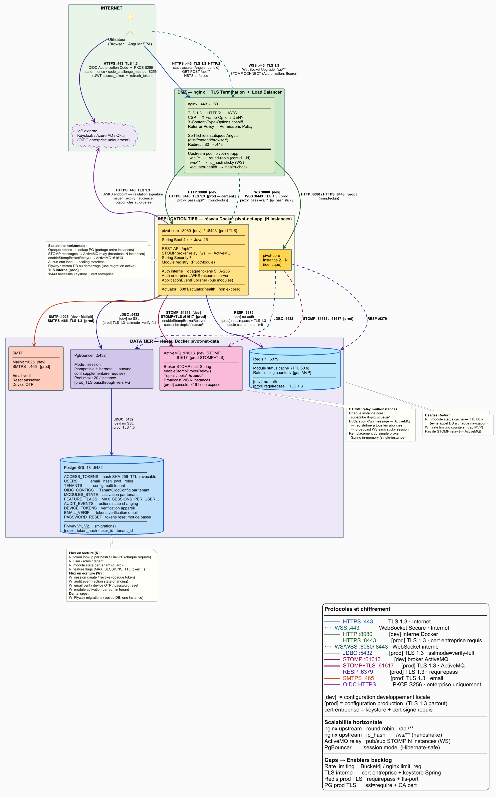

# Architecture cible — PIVOT Platform

## Vue d'ensemble

PIVOT est une suite collaborative auto-hébergeable, conçue pour les associations, TPE/PME et entreprises. Elle repose sur un système de **modules activables individuellement** par tenant, déployés dans des **JVMs isolées** pour garantir la résilience.



> Source PlantUML : [`diagrams/platform-overview.puml`](diagrams/platform-overview.puml)

---

## Topologie multi-repo

PIVOT est découpé en **repos spécialisés** par domaine fonctionnel :

| Repo | Rôle | Port (dev) |
|------|------|------------|
| **pivot-core** | Shell backend + Maven lib (`fr.pivot:pivot-core-starter`) · auth · tenant · team · module registry | :8080 |
| **pivot-ui** | Shell Angular + npm lib (`@pivot/ui-core`) · auth · admin · nav | — |
| **pivot-design-system** | Design system (`@pivot/design-system`) · Angular CDK + SCSS BEM + tokens | — |
| **pivot-pilotage-core** | roadmap · survey · quiz | :8081 |
| **pivot-pilotage-ui** | Frontend pilotage (lazy-loaded dans pivot-ui) | — |
| **pivot-agilite-core** | scrum-poker · standup · capacity | :8082 |
| **pivot-agilite-ui** | Frontend agilité (lazy-loaded dans pivot-ui) | — |
| **pivot-collaboratif-core** | whiteboard · session | :8083 |
| **pivot-collaboratif-ui** | Frontend collaboratif (lazy-loaded dans pivot-ui) | — |

### Principe de fault isolation

nginx route par **préfixe URL** vers la JVM dédiée au module. Si un module backend tombe :
- nginx retourne `503` sur son préfixe uniquement
- `pivot-core` (auth/tenant/team) reste disponible
- Les autres modules restent disponibles
- La SPA Angular affiche "Module temporairement indisponible" sur la feature concernée

---

## Flux et protocoles

**Cible prod : TLS 1.3 sur tous les flux (Zero Trust). Dev : HTTP/WS/no-auth en réseau Docker isolé.**

| Lien | Protocole | Dev | Prod |
|------|-----------|-----|------|
| Browser → nginx | HTTPS :443 | TLS 1.3 | TLS 1.3 · HTTP/2 · HSTS |
| Browser → nginx | WSS :443 /ws/** | TLS 1.3 | TLS 1.3 · STOMP upgrade |
| nginx → pivot-core | HTTP | :8080 | :8443 · TLS 1.3 · cert entreprise |
| nginx → pivot-pilotage-core | HTTP | :8081 | :8444 · TLS 1.3 |
| nginx → pivot-agilite-core | HTTP | :8082 | :8445 · TLS 1.3 |
| nginx → pivot-collaboratif-core | HTTP | :8083 | :8446 · TLS 1.3 |
| nginx → pivot-xxx-core | WS/WSS /ws/{domaine}/** | WS :808x | WSS :844x · ip_hash sticky |
| pivot-xxx-core → PostgreSQL | JDBC :5432 | no SSL | TLS 1.3 · `sslmode=verify-full` |
| pivot-xxx-core → Redis | RESP :6379 | no-auth | TLS 1.3 · `requirepass` |
| pivot-xxx-core → ActiveMQ | STOMP | :61613 | :61617 STOMP+TLS 1.3 |
| pivot-core → SMTP | SMTP/SMTPS | :1025 Mailpit | :465 SMTPS · TLS 1.3 |
| Browser → IdP | HTTPS :443 | TLS 1.3 | TLS 1.3 · OIDC PKCE S256 |
| pivot-core → IdP JWKS | HTTPS :443 | TLS 1.3 | TLS 1.3 · rotation auto-gérée |

> TLS interne [prod] nécessite un keystore Spring Boot + cert signé (entreprise ou CA interne). Enabler backlog dédié.

---

## Routing nginx (API Gateway)

```nginx
# pivot-core — auth, admin, superadmin
location /api/auth/        { proxy_pass http://pivot-core:8080; }
location /api/admin/       { proxy_pass http://pivot-core:8080; }
location /api/superadmin/  { proxy_pass http://pivot-core:8080; }

# pivot-pilotage-core
location /api/pilotage/    { proxy_pass http://pivot-pilotage-core:8081; }
location /ws/pilotage/     { proxy_pass http://pivot-pilotage-core:8081; }  # ip_hash

# pivot-agilite-core
location /api/agilite/     { proxy_pass http://pivot-agilite-core:8082; }
location /ws/agilite/      { proxy_pass http://pivot-agilite-core:8082; }   # ip_hash

# pivot-collaboratif-core
location /api/collaboratif/ { proxy_pass http://pivot-collaboratif-core:8083; }
location /ws/collaboratif/  { proxy_pass http://pivot-collaboratif-core:8083; }  # ip_hash

# SPA Angular (pivot-ui shell + lazy bundles)
location / { try_files $uri $uri/ /index.html; }
```

---

## Couches techniques

| Couche | Technologie | Repo |
|--------|-------------|------|
| Frontend shell | Angular 22 · TypeScript strict · SCSS BEM | pivot-ui |
| Frontend modules | Angular 22 · lazy-loaded · consomme @pivot/ui-core | pivot-xxx-ui |
| Design system | Angular CDK + SCSS BEM custom + tokens CSS · Storybook | pivot-design-system |
| Reverse proxy / API Gateway | nginx · HSTS · CSP · URL routing par préfixe | pivot-ui |
| API REST — core | Spring Boot 4.x · Java 25 · schéma `public` | pivot-core |
| API REST — modules | Spring Boot 4.x · Java 25 · schéma `{domaine}` | pivot-xxx-core |
| Base de données | PostgreSQL 18 · multi-schema · Spring Data JPA · Flyway | pivot-xxx-core |
| Cache | Redis 7 · module status TTL 60s · partagé entre backends | tous les backends |
| Message broker | ActiveMQ · STOMP relay · topics isolés par domaine | pivot-xxx-core |
| Auth interne | Spring Security 7 · Opaque tokens SHA-256 (BDD) | pivot-core |
| Auth enterprise | OIDC PKCE S256 (Angular) · resource server JWKS (Spring) | pivot-core + pivot-ui |
| Lib Maven partagée | `fr.pivot:pivot-core-starter` · TenantContext · PivotModule | pivot-core → pivot-xxx-core |
| Lib npm partagée | `@pivot/ui-core` · AuthService · Guards · Header/Footer | pivot-ui → pivot-xxx-ui |
| Tests backend | JUnit 5 · Mockito · Testcontainers | tous |
| Tests frontend | Vitest · Playwright | tous |
| CI/CD | GitHub Actions · SonarCloud · Plumber · Semantic Release | tous |
| Déploiement | Docker · Docker Compose | tous |

---

## Schéma BDD multi-schema

PostgreSQL unique, 4 schémas distincts :

| Schéma | Propriétaire | Contenu clé |
|--------|-------------|-------------|
| `public` | pivot-core | `tenants`, `users`, `access_tokens`, `oidc_configs`, `modules_state`, `teams`, `team_members`, `audit_events` |
| `pilotage` | pivot-pilotage-core | Tables métier roadmap/survey/quiz · FK → `public.tenants`, `public.teams` |
| `agilite` | pivot-agilite-core | Tables métier scrum/standup/capacity · FK → `public.tenants`, `public.teams` |
| `collaboratif` | pivot-collaboratif-core | Tables métier whiteboard/session · FK → `public.tenants`, `public.teams` |

**Règle absolue :** FK cross-schéma → schéma `public` uniquement. Pas de FK entre schémas modules. `teams` et `team_members` vivent obligatoirement dans `public` (pivot-core).

---

## Mécanismes d'authentification

PIVOT supporte deux mécanismes distincts selon le contexte de déploiement :

| Mécanisme | Contexte | Détail |
|-----------|---------|--------|
| **Opaque tokens** | Auth interne (email/password) | Token 256-bit SecureRandom · hash SHA-256 stocké en BDD (`access_tokens`) · raw token jamais persisté · TTL en BDD · révocable · max 5 sessions/utilisateur |
| **OIDC enterprise** | Tenants avec IdP externe | PKCE S256 côté Angular · validation JWKS côté Spring · multi-tenant (`TenantOidcConfig`) · rotation de clés IdP transparente |

> Access token toujours en mémoire uniquement — **jamais localStorage, jamais cookie**. Voir [ADR-005](pathname:///pivot-docs/adr/ADR-005-opaque-tokens).

**WebSocket auth** : Spring Security intercepte le handshake HTTP → opaque token vérifié avant l'upgrade WebSocket → connexion STOMP sécurisée. Chaque module-core gère ses propres connexions WS.

**CORS** : `http://localhost:4200` strict en dev. En prod avec nginx proxy, les appels API sont same-origin → CORS non requis côté backends.

---

## Modules activables

Chaque module est activable indépendamment par les admins tenant. Les modules sont déployés dans des **repos et JVMs distincts**.

| Domaine | Module | Backend | Frontend |
|---------|--------|---------|---------|
| `pilotage` | roadmap · survey · quiz | pivot-pilotage-core | pivot-pilotage-ui |
| `agilite` | scrum-poker · standup · capacity | pivot-agilite-core | pivot-agilite-ui |
| `collaboratif` | whiteboard · session | pivot-collaboratif-core | pivot-collaboratif-ui |

### Principe d'isolation

- Module désactivé → 403 côté API du module + bundle Angular non chargé (lazy-loading)
- Module backend KO → 503 nginx sur son préfixe · SPA affiche "Module temporairement indisponible"
- Contrat de module défini par `PivotModule` interface (packagée dans `fr.pivot:pivot-core-starter`)
- Aucune logique inter-module directe → `ApplicationEventPublisher` (backend) · services `@pivot/ui-core` (frontend)

---

## Schéma de rôles

| Rôle | Périmètre | Droits |
|------|-----------|--------|
| `ROLE_SUPER_ADMIN` | Plateforme | Gestion tenants, configuration globale |
| `ROLE_ADMIN` | Tenant | Activation modules, gestion utilisateurs |
| `ROLE_USER` | Tenant | Utilisation des modules activés |
| `ROLE_GUEST` | Session | Participation anonyme (sessions live) |

---

## Scalabilité et résilience

| Aspect | Mécanisme |
|--------|-----------|
| **Fault isolation** | 4 JVMs distinctes · module KO → 503 isolé · autres modules UP |
| **Scaling horizontal par module** | nginx upstream pool dédié par module · round-robin REST · ip_hash WS |
| **State partagé** | Opaque tokens en PostgreSQL (partagés entre instances d'un même module) |
| **STOMP multi-instance** | `enableStompBrokerRelay()` → ActiveMQ · topics isolés par domaine |
| **Redis** | Cache module status partagé (TTL 60s) · compteurs rate limiting [gap MVP] |
| **Migrations Flyway** | Verrou DB par module au démarrage (advisory lock PostgreSQL — une seule migration active par schéma) |

## Gaps — Enablers backlog

| Gap | Enabler cible |
|-----|--------------|
| Librairies partagées non publiées | EN17.1 (pivot-core-starter Maven) · EN17.3 (@pivot/ui-core npm) |
| Design system non créé | EN17.2 (@pivot/design-system npm · Angular CDK + SCSS BEM) |
| Convention BDD multi-schema | EN17.4 (Flyway isolation par schéma) |
| Templates repos modules | EN17.5 (pivot-xxx-core) · EN17.6 (pivot-xxx-ui) |
| Rate limiting absent | Bucket4j (Spring) ou `nginx limit_req` |
| TLS interne nginx→backends | Keystore Spring + cert entreprise + `proxy_ssl_*` nginx |
| Redis TLS prod | `requirepass` + `tls-port 6379` |
| PG TLS prod | `ssl=require` + CA cert dans JDBC URL |

---

## Déploiement

```bash
# Dev — compose.yml à la racine de pivot-platform
docker compose up -d
# Lance : nginx + pivot-core + pivot-pilotage-core + pivot-agilite-core +
#         pivot-collaboratif-core + postgres + redis + activemq + mailpit

# Production
# Image Docker nginx (pivot-ui shell + lazy bundles modules) :443
# Image Docker JRE pivot-core :8080
# Image Docker JRE pivot-pilotage-core :8081
# Image Docker JRE pivot-agilite-core :8082
# Image Docker JRE pivot-collaboratif-core :8083
# PostgreSQL managé + Redis managé + ActiveMQ
```
