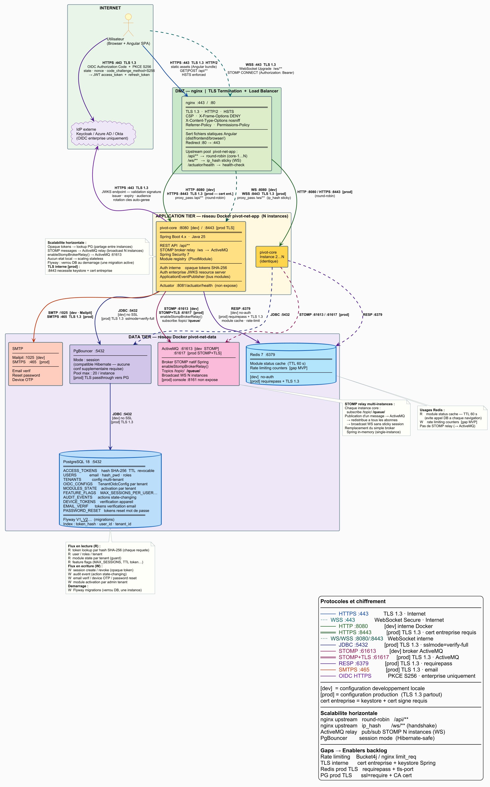

# Architecture cible — PIVOT Platform

## Vue d'ensemble

PIVOT est une suite collaborative auto-hébergeable, conçue pour les associations, TPE/PME et entreprises. Elle repose sur un système de **modules activables individuellement** par tenant, packagés comme **modules internes d'un unique backend Spring Modulith** (`pivot-core`), avec des **frontières de modules vérifiées** (`ApplicationModules.verify()`) et une isolation des données par schéma PostgreSQL.



> Source PlantUML : [`diagrams/platform-overview.puml`](diagrams/platform-overview.puml)
>
> **Bascule Spring Modulith** ([ADR-030](pathname:///pivot-docs/adr/ADR-030-bascule-spring-modulith), mergée 2026-07-17) : les domaines métier ne sont plus des repos/JVMs séparés. `agilite` et `collaboratif` sont des **modules internes** de `pivot-core` (`fr.pivot.agilite.*` / `fr.pivot.collaboratif.*`), le frontend est rapatrié dans le workspace unique `pivot-ui/projects/*`, et le domaine **Pilotage est retiré de PIVOT** (extraction, cf. `pivot-core/PILOTAGE-HANDOFF.md`). [ADR-006](pathname:///pivot-docs/adr/ADR-006-multi-repo-architecture) est supersédée pour les domaines métier.
>
> **`[transition]` — bascule runtime non terminée.** Le code est internalisé (un seul artefact, une seule JVM), mais `compose.yml` build encore les services standalone archivés et le nginx `pivot-ui` (dev **et** prod) route toujours `/api/{agilite,collaboratif}` vers ces services. Les blocs marqués `[transition]` ci-dessous décrivent la **cible modulith** ; le routage runtime reste à basculer vers `pivot-core:8080` (vague de suivi à planifier).

---

## Topologie modulith

PIVOT est structuré en **trois repos** ; les domaines métier vivent à l'intérieur du Socle :

| Repo | Rôle | Port (dev) |
|------|------|------------|
| **pivot-core** | Backend modulith · shell (auth · tenant · team · module registry) **+ modules internes `agilite` et `collaboratif`** · publie `fr.pivot:pivot-core-starter` (Maven) | :8080 |
| **pivot-ui** | Shell Angular + npm lib (`@pivot/ui-core`) · auth · admin · nav · **workspace unique `projects/*`** intégrant `agilite-ui`, `collaboratif-ui` et le `design-system` (Angular CDK + SCSS BEM + tokens) | — |
| **pivot-docs** | Documentation, ADR, backlog | — |

> Anciens repos `pivot-{agilite,collaboratif,pilotage}-{core,ui}` et `pivot-design-system` : **archivés** (lecture seule) — leur contenu vit désormais dans le Socle. Pilotage extrait vers un produit distinct.

### Principe de frontières de modules

Les frontières entre domaines sont **logiques** (modules Spring Modulith), pas physiques (process) :

- `ApplicationModules.verify()` vérifie l'**absence d'import croisé** (`agilite` ⇎ `collaboratif`) — chaque module ne dépend que du shell `fr.pivot.core.*`.
- Un module désactivé pour un tenant → `403` sur ses endpoints `/api/{domaine}/**` + bundle Angular non chargé (lazy-loading).
- Aucune logique inter-module directe → `ApplicationEventPublisher` (backend) · services `@pivot/ui-core` (frontend).

> `[transition]` Tant que le routage nginx pointe vers les services archivés, un module backend indisponible renvoie encore `503` sur son seul préfixe (fault isolation par process héritée). En cible modulith, la disponibilité des modules suit celle du process `pivot-core` unique.

---

## Flux et protocoles

**Cible prod : TLS 1.3 sur tous les flux (Zero Trust). Dev : HTTP/WS/no-auth en réseau Docker isolé.**

| Lien | Protocole | Dev | Prod |
|------|-----------|-----|------|
| Browser → nginx | HTTPS :443 | TLS 1.3 | TLS 1.3 · HTTP/2 · HSTS |
| Browser → nginx | WSS :443 /ws/** | TLS 1.3 | TLS 1.3 · STOMP upgrade |
| nginx → pivot-core (shell + modules internes) | HTTP | :8080 | :8443 · TLS 1.3 · cert entreprise |
| nginx → pivot-core /ws/{domaine}/** | WS/WSS | WS :8080 | WSS :8443 · ip_hash sticky |
| pivot-core → PostgreSQL | JDBC :5432 | no SSL | TLS 1.3 · `sslmode=verify-full` |
| pivot-core → Redis | RESP :6379 | no-auth | TLS 1.3 · `requirepass` |
| pivot-core → ActiveMQ | STOMP | :61613 | :61617 STOMP+TLS 1.3 |
| pivot-core → SMTP | SMTP/SMTPS | :1025 Mailpit | :465 SMTPS · TLS 1.3 |
| Browser → IdP | HTTPS :443 | TLS 1.3 | TLS 1.3 · OIDC PKCE S256 |
| pivot-core → IdP JWKS | HTTPS :443 | TLS 1.3 | TLS 1.3 · rotation auto-gérée |

> `[transition]` Le tableau décrit la cible modulith (tout le trafic `/api/**` et `/ws/**` vers `pivot-core:8080`). Aujourd'hui, le nginx dev & prod route encore `/api/{agilite,collaboratif}` et `/ws/{agilite,collaboratif}` vers les services standalone archivés (:8082 / :8083).
>
> TLS interne [prod] nécessite un keystore Spring Boot + cert signé (entreprise ou CA interne). Enabler backlog dédié.

---

## Routing nginx (API Gateway)

Cible modulith — tout le trafic backend converge vers `pivot-core:8080` :

```nginx
# pivot-core — shell (auth, admin, superadmin)
location /api/auth/        { proxy_pass http://pivot-core:8080; }
location /api/admin/       { proxy_pass http://pivot-core:8080; }
location /api/superadmin/  { proxy_pass http://pivot-core:8080; }

# module interne agilite
location /api/agilite/     { proxy_pass http://pivot-core:8080; }
location /ws/agilite/      { proxy_pass http://pivot-core:8080; }   # ip_hash

# module interne collaboratif
location /api/collaboratif/ { proxy_pass http://pivot-core:8080; }
location /ws/collaboratif/  { proxy_pass http://pivot-core:8080; }  # ip_hash

# SPA Angular (pivot-ui shell + lazy bundles)
location / { try_files $uri $uri/ /index.html; }
```

> `[transition]` Configuration cible. Le nginx effectif (dev & prod) route encore `/api/{agilite,collaboratif}` vers `pivot-agilite-core:8082` / `pivot-collaboratif-core:8083` (services archivés) — bascule vers `pivot-core:8080` à planifier.

---

## Couches techniques

| Couche | Technologie | Localisation |
|--------|-------------|--------------|
| Frontend shell | Angular 22 · TypeScript strict · SCSS BEM | pivot-ui |
| Frontend modules | Angular 22 · lazy-loaded · consomme @pivot/ui-core | pivot-ui/projects/{agilite,collaboratif}-ui |
| Design system | Angular CDK + SCSS BEM custom + tokens CSS · Storybook | pivot-ui/projects/design-system |
| Reverse proxy / API Gateway | nginx · HSTS · CSP · URL routing par préfixe | pivot-ui |
| API REST — shell | Spring Boot 4.x · Java 25 · schéma `public` | pivot-core (`fr.pivot.core.*`) |
| API REST — modules | Spring Boot 4.x · Java 25 · schéma `{domaine}` | pivot-core (`fr.pivot.{agilite,collaboratif}.*`) |
| Base de données | PostgreSQL 18 · multi-schema · Spring Data JPA · Flyway | pivot-core (par module) |
| Cache | Redis 7 · module status TTL 60s | pivot-core |
| Message broker | ActiveMQ · STOMP relay · topics isolés par domaine | pivot-core (par module) |
| Auth interne | Spring Security 7 · Opaque tokens SHA-256 (BDD) | pivot-core |
| Auth enterprise | OIDC PKCE S256 (Angular) · resource server JWKS (Spring) | pivot-core + pivot-ui |
| Lib Maven partagée | `fr.pivot:pivot-core-starter` · TenantContext · PivotModule | pivot-core → modules internes |
| Lib npm partagée | `@pivot/ui-core` · AuthService · Guards · Header/Footer | pivot-ui → projects/* |
| Tests backend | JUnit 5 · Mockito · Testcontainers · `ApplicationModules.verify()` | pivot-core |
| Tests frontend | Vitest · Playwright | pivot-ui |
| CI/CD | GitHub Actions · SonarCloud · Plumber · Semantic Release | tous |
| Déploiement | Docker · Docker Compose | pivot-core (artefact unique) |

---

## Schéma BDD multi-schema

PostgreSQL unique, un schéma par domaine — l'isolation des données est **conservée** malgré l'internalisation (chaque module pilote ses migrations Flyway dans une JVM unique) :

| Schéma | Propriétaire | Contenu clé |
|--------|-------------|-------------|
| `public` | pivot-core (shell) | `tenants`, `users`, `access_tokens`, `oidc_configs`, `modules_state`, `teams`, `team_members`, `audit_events` |
| `agilite` | pivot-core · module interne `agilite` | Tables métier scrum/standup/capacity · FK → `public.tenants`, `public.teams` |
| `collaboratif` | pivot-core · module interne `collaboratif` | Tables métier whiteboard/session · FK → `public.tenants`, `public.teams` |

**Règle absolue :** FK cross-schéma → schéma `public` uniquement. Pas de FK entre schémas modules. `teams` et `team_members` vivent obligatoirement dans `public` (pivot-core).

> Le schéma `pilotage` **quitte PIVOT** avec le domaine Pilotage (extraction ADR-030). Le `DROP SCHEMA pilotage` reste une action irréversible en attente de décision explicite du mainteneur.

---

## Mécanismes d'authentification

PIVOT supporte deux mécanismes distincts selon le contexte de déploiement :

| Mécanisme | Contexte | Détail |
|-----------|---------|--------|
| **Opaque tokens** | Auth interne (email/password) | Token 256-bit SecureRandom · hash SHA-256 stocké en BDD (`access_tokens`) · raw token jamais persisté · TTL en BDD · révocable · max 5 sessions/utilisateur |
| **OIDC enterprise** | Tenants avec IdP externe | PKCE S256 côté Angular · validation JWKS côté Spring · multi-tenant (`TenantOidcConfig`) · rotation de clés IdP transparente |

> Access token toujours en mémoire uniquement — **jamais localStorage, jamais cookie**. Voir [ADR-005](pathname:///pivot-docs/adr/ADR-005-opaque-tokens).

**WebSocket auth** : Spring Security intercepte le handshake HTTP → opaque token vérifié avant l'upgrade WebSocket → connexion STOMP sécurisée. Chaque module gère ses propres connexions WS au sein du backend unique.

**CORS** : `http://localhost:4200` strict en dev. En prod avec nginx proxy, les appels API sont same-origin → CORS non requis côté backend.

---

## Modules activables

Chaque module est activable indépendamment par les admins tenant. Les modules métier sont des **modules internes** de `pivot-core` (packages `fr.pivot.{domaine}.*`), déployés dans l'artefact et le process uniques du modulith.

| Domaine | Module | Backend | Frontend |
|---------|--------|---------|----------|
| `agilite` | scrum-poker · standup · capacity | pivot-core · `fr.pivot.agilite.*` | pivot-ui/projects/agilite-ui |
| `collaboratif` | whiteboard · session | pivot-core · `fr.pivot.collaboratif.*` | pivot-ui/projects/collaboratif-ui |

### Principe d'isolation

- Module désactivé → 403 côté API du module + bundle Angular non chargé (lazy-loading)
- Frontières de modules vérifiées par `ApplicationModules.verify()` — aucun import croisé entre domaines
- Contrat de module défini par `PivotModule` interface (packagée dans `fr.pivot:pivot-core-starter`)
- Aucune logique inter-module directe → `ApplicationEventPublisher` (backend) · services `@pivot/ui-core` (frontend)

> `[transition]` Tant que le routage nginx pointe vers les services archivés, un module backend KO renvoie encore `503` sur son préfixe (SPA : "Module temporairement indisponible"). En cible modulith, les modules partagent la disponibilité du process `pivot-core`.

---

## Schéma de rôles

| Rôle | Périmètre | Droits |
|------|-----------|--------|
| `ROLE_SUPER_ADMIN` | Plateforme | Gestion tenants, configuration globale |
| `ROLE_ADMIN` | Tenant | Activation modules, gestion utilisateurs |
| `ROLE_USER` | Tenant | Utilisation des modules activés |
| `ROLE_GUEST` | Session | Participation anonyme (sessions live) |

---

## Scalabilité et résilience

| Aspect | Mécanisme |
|--------|-----------|
| **Frontières de modules** | Modules internes vérifiés (`ApplicationModules.verify()`) · aucun import croisé · isolation données par schéma |
| **Scaling horizontal** | Réplication du backend modulith (plusieurs instances `pivot-core`) derrière nginx · round-robin REST · ip_hash WS sticky |
| **State partagé** | Opaque tokens en PostgreSQL (partagés entre instances) |
| **STOMP multi-instance** | `enableStompBrokerRelay()` par module → ActiveMQ · topics isolés par domaine |
| **Redis** | Cache module status (TTL 60s) · compteurs rate limiting [gap Socle] |
| **Migrations Flyway** | Verrou DB par module au démarrage (advisory lock PostgreSQL — une seule migration active par schéma), dans une JVM unique |

## Gaps — Enablers backlog

| Gap | Enabler cible |
|-----|--------------|
| Librairies partagées non publiées | EN17.1 (pivot-core-starter Maven) · EN17.3 (@pivot/ui-core npm) |
| Convention BDD multi-schema | EN17.4 (Flyway isolation par schéma) |
| Bascule runtime nginx/compose vers modulith | Vague de suivi ADR-030 (routage `/api/{agilite,collaboratif}` → `pivot-core:8080`, retrait des services archivés) |
| Rate limiting absent | Bucket4j (Spring) ou `nginx limit_req` |
| TLS interne nginx→backend | Keystore Spring + cert entreprise + `proxy_ssl_*` nginx |
| Redis TLS prod | `requirepass` + `tls-port 6379` |
| PG TLS prod | `ssl=require` + CA cert dans JDBC URL |

---

## Déploiement

Cible modulith — un artefact backend unique :

```bash
# Dev — compose.yml
docker compose up -d
# Cible : nginx + pivot-core (modulith : shell + modules agilite/collaboratif) +
#         postgres + redis + activemq + mailpit
# [transition] le compose.yml actuel build encore les services standalone
#              archivés (pivot-agilite-core, pivot-collaboratif-core) — à retirer
#              une fois le routage nginx basculé vers pivot-core:8080

# Production
# Image Docker nginx (pivot-ui shell + lazy bundles modules) :443
# Image Docker JRE pivot-core :8080  (artefact modulith unique — shell + modules internes)
# PostgreSQL managé + Redis managé + ActiveMQ
```
